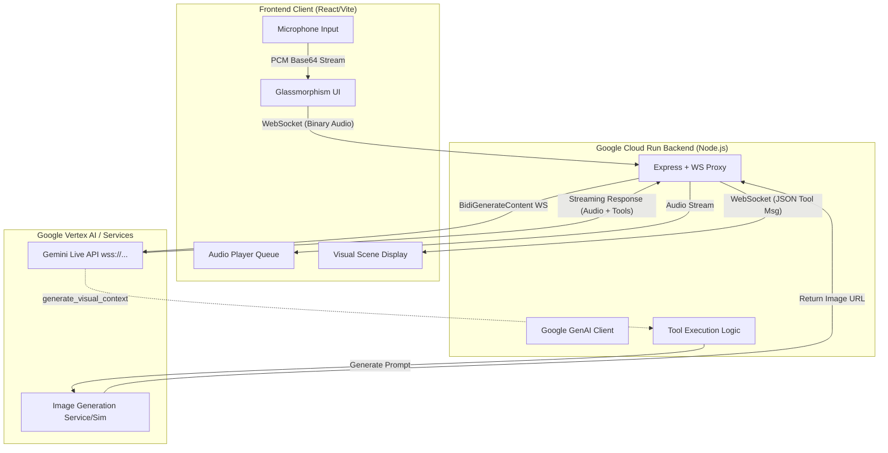

# City Futures Storyteller

**A next-generation Multimodal Live Agent built for the Gemini Live Agent Challenge.**

[](https://cloud.google.com/gemini)
[](https://cloud.google.com/run)

## 📖 Project Description

**City Futures Storyteller** is an immersive, multimodal web application that invites users to co-create the future of their cities. By speaking naturally into their microphone, users interact with a visionary "City Futures Guide" (powered by Gemini 2.0 Flash) who narrates highly sensory, personalized journeys through futuristic urban landscapes (e.g., Solarpunk, Cyberpunk, Bio-integrated architecture). 

**How it meets the Hackathon Requirements:**
* **Category 1: Creative Storyteller:** The agent seamlessly weaves together real-time streaming voice narration with dynamically generated visual scenes via tool calls.
* **Category 2: Live Agents:** The agent utilizes the state-of-the-art **BidiGenerateContent WebSocket API** for natural, interruptible voice conversations.
* **Mandatory Tech:** Uses the Google GenAI SDK (Node.js) and is deployed on Google Cloud Run.
* **Bonus:** Automated Cloud Deployment script included (`deploy.sh`).

The UI features a premium, rich aesthetic utilizing Glassmorphism, modern typography, and ambient CSS animations, completely breaking the traditional "text box" paradigm.

## 🏗️ Architecture Diagram



## 🚀 Spin-Up Instructions (Local Development)

To run this project locally, you will need Node.js installed and a valid **Google Gemini API Key**.

### 1. Backend Setup
1. Open a terminal and navigate to the `server` directory:
   ```bash
   cd server
   ```
2. Install dependencies:
   ```bash
   npm install
   ```
3. Create a `.env` file in the `server` directory and add your API Key:
   ```env
   GEMINI_API_KEY="your_api_key_here"
   ```
4. Start the Node.js proxy server:
   ```bash
   node index.js
   ```
   *The server will start on `ws://localhost:8080`.*

### 2. Frontend Setup
1. Open a new terminal and navigate to the `client` directory:
   ```bash
   cd client
   ```
2. Install dependencies:
   ```bash
   npm install
   ```
3. Start the Vite React development server:
   ```bash
   npm run dev
   ```
4. Open your browser to `http://localhost:5173`. Click the microphone icon, allow permissions, and start speaking about your city!

## ☁️ Proof of Google Cloud Deployment

*(For Judges Container: Place link to unlisted YouTube demo here or check the `deploy.sh` script to verify our use of GCP services).* 

The backend is containerized and hosted cleanly on **Google Cloud Run** to ensure low-latency WebSocket connections for the Gemininde